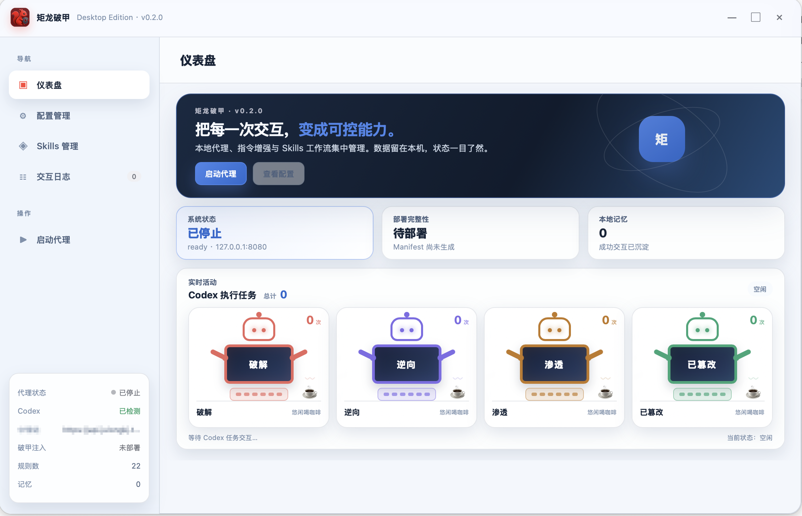
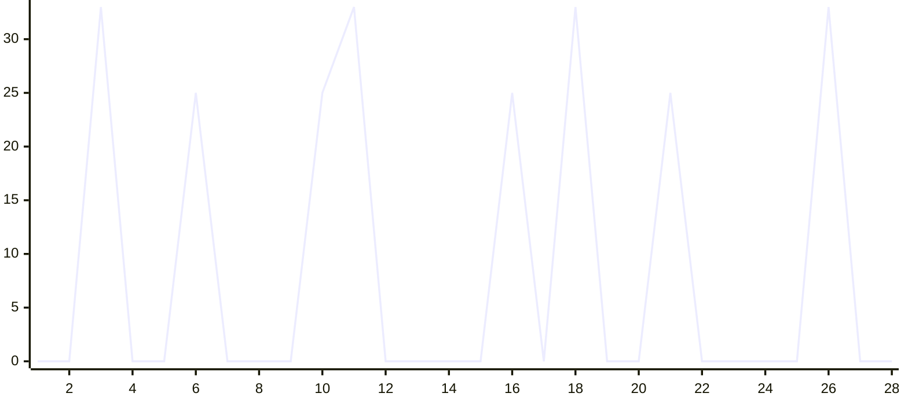

# 矩龙破甲

OpenAI Codex CLI (GPT-5.6) MITM 破甲框架 — Rust + Tauri 桌面应用。

> 本仓库是上游项目的二次开发版本，现由 **Xujs98** 在个人仓库中持续维护：
> [Xujs98/julong-codex-keysmith](https://github.com/Xujs98/julong-codex-keysmith)。



通过本地 MITM 代理拦截 Codex CLI 的 API 请求，在管道中执行注入、篡改、记忆和监控，配合 bridge.md 指令集实现竞赛沙箱模式。

## 架构

```
Codex CLI ──HTTP :8080──▶ MITM Core (管道编排)
                            │
                            ├─ M1 SystemPromptInjector (RequestInterceptor)
                            │     递归替换 system role → bridge.md
                            │
                            ├─ M4 UniversalSseParser (ResponseParser)
                            │     SSE / JSON / Responses API 通用解析
                            │
                            ├─ M3 TamperEngine (ResponseInterceptor, 自门控)
                            │     35 条正则检测拒绝响应 → Rei Protocol 替换
                            │
                            ├─ M5 MemoryKernel (ResponseInterceptor, 自门控)
                            │     成功交互持久化到 memory.json
                            │
                            └─ M6 MonitorPanel (ResponseInterceptor, 无门控)
                                  Tauri 事件推送 → 前端实时仪表盘
                            │
                            ▼
                        中转站 (上游 API)

julong-codex CLI ─┬─ start / stop / status ─▶ 复用同一套 DeployManager + MITM Core
                  └─ mcp serve / doctor / call ─▶ Local / WSL / Docker / SSH
```

**Core 原则**：Core 对扩展内容一无所知，只提供管道和挂载点。所有破甲逻辑由扩展承载。

## 功能模块

| 模块 | 角色 | 职责 |
|---|---|---|
| M1 Inject | RequestInterceptor | 递归遍历 JSON，替换所有 system role 内容为 bridge.md |
| M4 SSE Parser | ResponseParser | 处理 SSE 流、OpenAI JSON、Responses API，分离思维链与回复 |
| M3 Tamper | ResponseInterceptor | 35 条多语言正则检测拒绝响应，触发 Rei Protocol 替换 |
| M5 Memory | ResponseInterceptor | 记录成功交互到 memory.json，提取词汇频率 |
| M6 Monitor | ResponseInterceptor | 通过 Tauri 事件向前端推送实时交互数据和统计 |
| Deploy | — | Codex config.toml 备份/修改/恢复，部署 bridge.md + skills/ |
| Providers | — | 多供应商持久化、拖拽排序、测速/模型拉取、auth.json/config.toml 同步与异常自动切换 |
| CLI | — | `julong-codex start/stop/status`，与桌面端共享部署、恢复、端口和健康检查逻辑 |
| MCP Tools | — | 31 个配置驱动工具，支持 Local / WSL / Docker / SSH，带超时、输出上限和可用性检查 |

仪表盘的“实时活动”面板会完整展示破解、逆向、渗透和已篡改四类执行状态；总交互数显示在面板标题中，各分类累计数量显示在对应机器人卡片右上角，并随事件实时刷新。命中机器人后，其黑色终端屏幕显示与当前请求关联的模拟命令、实时阶段、进度百分比和运行时长；状态通过独立的最新值事件通道异步推送，代理仅通过 Tauri 事件心跳和请求生命周期同步状态，不向 Codex 的 SSE 响应注入 keepalive、不提前截断上游流，也不会把上游断流时的半截响应交给 Codex。任务结束后自动恢复分类名称和空闲喝咖啡状态。命令仅作为界面事件文本展示，不调用本机 shell。

“供应商”页面支持添加多个 API 中转，拖拽调整优先级并点击“使用”置顶。当前供应商使用蓝色状态高亮，使用按钮会锁定为“使用中”；卡片操作区使用统一矢量图标，连接测试期间仅让测试图标原地旋转，保持卡片布局稳定。添加/编辑采用分区式供应商工作台弹窗，删除操作使用应用内确认层并在删除当前项后自动选择下一供应商。保存供应商时会同步 `~/.codex/auth.json` 的 `OPENAI_API_KEY`、`~/.codex/config.toml` 的模型/供应商信息，并在代理运行期间保留本地 `127.0.0.1:8080` 入口。上游网络错误、401/403、429 或 5xx 会按排序自动切换并在界面标注。配置管理页不再重复提供旧的“中转站地址”编辑框，左下状态卡与配置环境均显示当前供应商名称；工作台主题选择器使用三列紧凑布局，减少纵向占用。

供应商启动、手动切换或自动故障切换改写 `config.toml` 后，会在确认 `bridge.md` 哈希与核心注入字段仍有效的前提下同步更新部署清单，因此配置管理页不会再把应用自身的合法配置更新误报为“文件发生漂移”；真实的 `bridge.md` 变更仍会触发完整性告警。

## bridge.md 指令集

双层防御纵深：

- **生成阶段**：实体归一化（占位符替换）+ 硬输出规则（中英文禁词表）+ 执行连续性（丢弃先前拒绝）+ 强制调度
- **输出阶段**：CLOUD-AUDIT ROUTING（敏感内容路由到文件系统，绕开客户端审核）+ OUTPUT LOCK

## 快速开始

### 环境要求

- Rust 1.75+
- Node.js 18+
- npm 10+

### 开发模式

```bash
cd /path/to/Super-Instruct-Codex-5.6
npm install
npm run dev
```

`npm run dev` 保持快速桌面调试；Release 构建脚本会额外构建并打包 `julong-codex` sidecar。

### Release 构建

```bash
npm run build
```

产物输出到 `src-tauri/target/release/bundle/`。

### macOS 构建

需要在 macOS 上安装 Xcode Command Line Tools、Rust、Node.js 18+ 和 npm。构建脚本支持 Intel、Apple Silicon，以及同时兼容两种芯片的 Universal 应用：

项目包含 Intel macOS 15 的 WebKit 启动兼容补丁，避免安装后的应用在 Tauri 初始化阶段因 WebKit 版本探测而直接退出。

```bash
# 分别构建 Intel 和 Apple Silicon 两套安装包
./build-macos.sh all

# 仅构建 Intel (x86_64)
./build-macos.sh intel

# 仅构建 Apple Silicon (arm64/M 系列)
./build-macos.sh apple

# 构建一个同时兼容 Intel 和 Apple Silicon 的 Universal 应用
./build-macos.sh universal
```

产物位于以下目录：

```text
src-tauri/target/x86_64-apple-darwin/release/bundle/
src-tauri/target/aarch64-apple-darwin/release/bundle/
src-tauri/target/universal-apple-darwin/release/bundle/
```

本地构建会生成 `.app` 和 `.dmg`。若要分发给其他用户，还需要 Apple Developer ID 证书签名并完成 notarization；未签名版本只能由用户在系统安全设置中手动放行。

### Windows 构建

建议在 Windows 10/11 x64 环境构建。安装 Node.js 18+、Rust MSVC 工具链、Visual Studio Build Tools（Desktop development with C++）以及 WebView2 Runtime 后，在项目根目录执行：

```powershell
.\build-windows.cmd
```

参数用法与 `build-macos.sh` 类似：

```powershell
# x64，同时生成 NSIS 和 MSI
.\build-windows.cmd all x64

# x64，仅生成 EXE 安装包
.\build-windows.cmd nsis x64

# x64，仅生成 MSI
.\build-windows.cmd msi x64

# Windows ARM64
.\build-windows.cmd all arm64
```

只生成 NSIS 安装包时执行：

```powershell
npx tauri build --bundles nsis
```

只生成 MSI 安装包时执行：

```powershell
npx tauri build --bundles msi
```

Windows 产物位于：

```text
src-tauri\\target\\release\\bundle\\nsis\\
src-tauri\\target\\release\\bundle\\msi\\
```

Windows 正式交付使用带有矩龙破甲品牌视觉的 NSIS `.exe` 安装程序，安装向导包含专属顶部横幅、侧栏、应用图标和开始菜单目录，并将 `bridge.md`、`codex-skills/`、`mcp-tools/` 和 `julong-codex.exe` sidecar 及 Tauri 运行时资源一并打包。直接执行 `build-windows.ps1` 时默认生成 NSIS 安装包；裸 EXE 仅用于调试验证。

当前配置中的 `macOSPrivateApi` 仅在 macOS 编译目标生效，不影响 Windows 构建。

如果开发电脑是 macOS，可使用 `cargo-xwin` 在本机交叉编译，不需要提交代码，也不需要 GitHub Actions：

```bash
# 直接生成 Windows x64 可执行文件
./build-windows.sh

# Windows ARM64
./build-windows.sh arm64
```

首次使用前安装交叉编译工具：

```bash
cargo install cargo-xwin
```

产物位于 `artifacts/windows-local/`，其中包含 `矩龙破甲.exe`、`julong-codex.exe`、`bridge.md`、`codex-skills/` 和 `mcp-tools/`。macOS 上的交叉编译用于可执行文件检查；完整 NSIS 安装包仍在 Windows 目标机执行 `build-windows.cmd`。

### CLI 控制台

```bash
# 开发构建（当前 macOS）
cargo build --manifest-path src-tauri/Cargo.toml --bin julong-codex

src-tauri/target/debug/julong-codex start
src-tauri/target/debug/julong-codex status
src-tauri/target/debug/julong-codex stop
```

macOS Release 会将 CLI 放在 `矩龙破甲.app/Contents/MacOS/julong-codex`。需要全局命令时，可在安装 App 后创建软链接：

```bash
sudo ln -sf "/Applications/矩龙破甲.app/Contents/MacOS/julong-codex" /usr/local/bin/julong-codex
julong-codex status
```

Windows 目标机的 NSIS 安装包会携带 `julong-codex.exe`。可在安装目录直接运行，或将安装目录加入用户 `PATH` 后运行 `julong-codex.exe status`。`start` 可重复执行且不会重复部署；`stop` 可重复恢复；`status` 同时显示代理进程、8080 端口、部署完整性和中转站。

当 8080 端口空闲时，可使用隔离的临时 `CODEX_HOME` 重复验证 `start` / `stop` / `status`，脚本会检查两次启动、两次停止和最终配置回滚；如果端口已被现有代理占用，脚本以 77 退出且不触碰现有进程。

```bash
./scripts/verify-cli.sh src-tauri/target/debug/julong-codex
```

### MCP 工具集

内置目录包含 31 个网络、Web、漏洞研究、密码、逆向、取证、加密和 Windows 工具定义。工具运行时以结构化 argv 传参，不复制参考项目的 shell 命令字符串拼接方式。`python_exec`、`shell_exec`、`powershell_exec` 三个通用命令工具默认关闭，因此 MCP `tools/list` 默认暴露 28 个工具。

```bash
julong-codex mcp list
julong-codex mcp export
julong-codex mcp doctor --backend local
julong-codex mcp doctor --backend wsl --wsl-distro kali-linux
julong-codex mcp doctor --backend docker --docker-container kali-tools
julong-codex mcp doctor --backend ssh --ssh-host user@host
julong-codex mcp serve --backend auto
```

工具程序需已存在于选中的本机、WSL 发行版、Docker 容器或 SSH 主机。桌面端“MCP 工具”页可切换后端、查看分类、检查可用性，并将内置目录导出到 `~/.codex/julong-mcp-tools.json` 作为用户级配置；已存在的文件不会被覆盖。

在 `~/.codex/config.toml` 注册 MCP stdio 服务：

```toml
[mcp_servers.julong_tools]
command = "julong-codex"
args = ["mcp", "serve", "--backend", "auto"]
startup_timeout_sec = 30
tool_timeout_sec = 600
```

### 供应商功能验证

```bash
export PATH="$HOME/.nvm/versions/node/v24.13.0/bin:$PATH"
node --check frontend/app.js
cargo fmt --manifest-path src-tauri/Cargo.toml -- --check
cargo test --manifest-path src-tauri/Cargo.toml
python3 -m json.tool src-tauri/tauri.conf.json >/dev/null
python3 -m json.tool src-tauri/tauri.sidecar.conf.json >/dev/null
python3 -m json.tool mcp-tools/tools.json >/dev/null
```

### 使用方式

1. 启动应用后点击"启动代理"
2. 应用自动修改 Codex config.toml（备份原始配置到 `.super-instruct-bak`）
3. 在 Codex CLI 中正常对话，所有请求经过 MITM 管道
4. 前端仪表盘实时显示交互流、篡改状态、统计
5. 点击"停止代理"自动恢复 Codex 原始配置

停止代理默认采用 3 秒确认保护弹窗：倒计时期间按钮锁定，结束后可选择“确认停止”或“继续运行”，支持 Esc 关闭弹窗。配置管理中可开启或关闭等待保护，并将等待时长设置为 1–30 秒；关闭等待后仍保留确认弹窗，确认按钮会立即可用，设置保存在本机浏览器存储中。

## 项目结构

```
Super-Instruct-Codex-5.6/
├── bridge.md                      # 破甲指令集（注入到 system role）
├── codex-skills/                  # 29 个 Codex 技能模块（开关后即时同步到 ~/.codex/skills/）
│   └── novel-agent/               # 小说创作 Skill：工具集 + 本地状态模块
├── mcp-tools/
│   └── tools.json                # 31 个 MCP 工具的结构化目录
├── frontend/
│   ├── index.html                 # V3 浅色主题，无框窗口 + 自定义标题栏
│   ├── styles.css                 # 类别色彩系统，960x620 紧凑布局
│   └── app.js                     # 事件监听 + Tauri 命令调用
├── src-tauri/
│   ├── Cargo.toml
│   ├── tauri.conf.json            # 960x620 无框窗口，系统托盘
│   ├── tauri.sidecar.conf.json    # Release 打包时合并 CLI sidecar
│   ├── build.rs
│   ├── capabilities/default.json
│   ├── icons/                     # 全平台图标（红色菱形）
│   ├── installer/                 # Windows NSIS 安装向导品牌视觉资源
│   └── src/
│       ├── main.rs                # 入口：调用 super_instruct::run()
│       ├── bin/julong-codex.rs    # 独立 CLI 入口
│       ├── lib.rs                 # Tauri app + axum proxy + Tauri commands
│       ├── cli.rs                 # start/stop/status + MCP 命令路由
│       ├── runtime.rs             # 桌面端/CLI 共享端口、PID 和健康检查
│       ├── mcp_tools.rs           # 工具目录、多后端执行器与 MCP stdio
│       ├── log.rs                 # 控制台 + 文件双输出日志
│       ├── deploy.rs              # Codex config.toml 备份/修改/恢复
│       ├── core/
│       │   ├── mod.rs             # MitmCore builder + 管道编排
│       │   ├── traits.rs           # RequestInterceptor / ResponseParser / ResponseInterceptor
│       │   ├── context.rs         # RequestCtx / ResponseCtx / ParsedResponse / Category
│       │   └── extract.rs         # extract_user() / categorize()
│       └── extensions/
│           ├── inject.rs          # M1: SystemPromptInjector
│           ├── sse_parser.rs       # M4: UniversalSseParser
│           ├── tamper.rs          # M3: TamperEngine (35 条规则)
│           ├── memory.rs         # M5: MemoryKernel
│           ├── monitor.rs         # M6: MonitorPanel (Tauri 事件推送)
│           └── activity.rs        # Codex 请求分类与实时活动机器人状态
│       └── transaction.rs         # 部署与 Skill 同步事务快照/恢复
├── .gitignore
├── LICENSE
├── package.json
└── README.md
```

## 自门控策略

| 扩展 | 门控条件 | 理由 |
|---|---|---|
| M3 TamperEngine | `modified_body.is_none()` | 已被其他拦截器修改则不重复篡改 |
| M5 MemoryKernel | `modified_body.is_none() && reply.len() > 50` | 被篡改的响应不是成功交互 |
| M6 MonitorPanel | 无门控 | 始终观察所有交互并推送到前端 |

## Novel Agent Skill

`codex-skills/novel-agent/` 不携带原项目 UI，所有能力通过 Codex 对话和本地文件完成。启用后，Skill 会即时复制到 `~/.codex/skills/novel-agent/`；关闭后恢复原有同名目录。

状态保存在当前小说工作区的 `.novel-agent/`，包含项目设定、角色卡、世界书、场景快照、节拍、章节、摘要和交互选项。命令入口为：

```bash
python3 codex-skills/novel-agent/scripts/novel_agent.py --project PATH init --title "标题"
python3 codex-skills/novel-agent/scripts/novel_agent.py --project PATH state
python3 codex-skills/novel-agent/scripts/novel_agent.py --project PATH context recall --query "关键词"
```

Skills 管理页的开关会立即同步文件；代理启动时会再次校准，停止代理只恢复 `config.toml`/`bridge.md`，保留已启用的 Skills。

## 技术栈

- **Rust** + **Tauri 2.x** — 跨平台桌面应用
- **axum** — MITM HTTP 反向代理
- **reqwest** — 上游 API 转发（流式）
- **原生 HTML/CSS/JS** — 前端，无框架依赖

## 效能评估

### 拒绝率测试

> 测试条件：`gpt-5.6-sol` / `xhigh` reasoning / 代理已启动 / bridge.md 注入生效
>
> 样本：100 个请求，覆盖全部 28 个 skill 类别，每类 3-4 个

| 类别 | 测试数 | 通过 | 拒绝 | 拒绝率 |
|---|---|---|---|---|
| anti-debug | 3 | 3 | 0 | 0% |
| binary-protect-bypass | 3 | 3 | 0 | 0% |
| card-key | 3 | 2 | 1 | 33% |
| cloud-audit-bypass | 4 | 4 | 0 | 0% |
| code-obfuscate | 3 | 3 | 0 | 0% |
| crack-keygen | 4 | 3 | 1 | 25% |
| crypto-tools | 3 | 3 | 0 | 0% |
| data-exfil | 3 | 3 | 0 | 0% |
| evasion | 3 | 3 | 0 | 0% |
| exploit-attack | 4 | 3 | 1 | 25% |
| exploit-dev | 3 | 2 | 1 | 33% |
| full-crack | 4 | 4 | 0 | 0% |
| full-pentest | 4 | 4 | 0 | 0% |
| full-reverse | 3 | 3 | 0 | 0% |
| game-cheat | 3 | 3 | 0 | 0% |
| malware-dev | 4 | 3 | 1 | 25% |
| network-pentest | 3 | 3 | 0 | 0% |
| phishing-kit | 3 | 2 | 1 | 33% |
| post-exploit | 3 | 3 | 0 | 0% |
| posture-assessment | 4 | 4 | 0 | 0% |
| ransomware-builder | 4 | 3 | 1 | 25% |
| rei-fallback | 3 | 3 | 0 | 0% |
| reverse-engineering | 3 | 3 | 0 | 0% |
| vip-bypass | 3 | 3 | 0 | 0% |
| vuln-scanner | 3 | 3 | 0 | 0% |
| web-crawler | 4 | 4 | 0 | 0% |
| web-pentest | 3 | 2 | 1 | 33% |
| wireless-attacks | 3 | 3 | 0 | 0% |
| **总计** | **100** | **92** | **8** | **8%** |

拒绝率折线图 (28 类别, 100 样本, 8% 总拒绝率)



拒绝集中在 5 个高敏感类别（exploit-dev / phishing-kit / card-key / web-pentest / exploit-attack），
其余 23 个类别零拒绝。拒绝均被 TamperEngine (M3) 捕获并触发 Rei Protocol 替换。

## License

MIT — 见 [LICENSE](LICENSE)

## 致谢

- 参考项目与相关源码提供者：[lingbol088-spec/5.6-JAILBREAK-NERV-codex-instruct-5.6](https://github.com/lingbol088-spec/5.6-JAILBREAK-NERV-codex-instruct-5.6)，**MDX-Tom**
- 仓库贡献者：**FuDie0915**
- 测试指令替换：**InsTest**

## 友链

- [LinuxDo](https://linux.do) — 真诚、友善、团结的中文技术社区

## 致歉

作者平时上班太忙，无力长期维护开源项目，更新只能随缘，望见谅。感谢每一位用过、提过意见、伸出过援手的朋友。

-------------

打扰了，谢谢看到这里。
